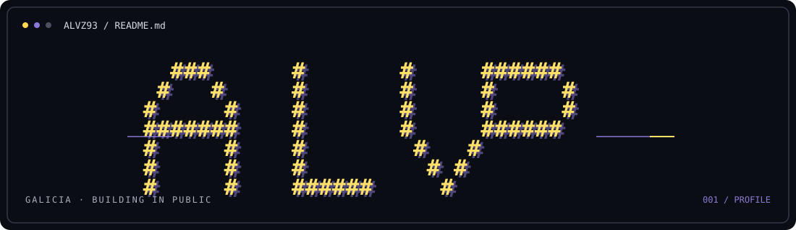

  

  <strong>Construyendo Raíces Galicia</strong> 
  Tecnología para conectar personas, proyectos y oportunidades rurales.

<table>
  <tr>
    <td width="58%" valign="top">
      <h3>Ahora mismo</h3>
      
Estoy dando forma a Raíces Galicia, un prototipo para reunir oportunidades, conocimiento y recursos del rural gallego.

    </td>
    <td width="42%" valign="top" align="center">
      <h3>Stack del proyecto</h3>
      
      
      
    </td>
  </tr>
</table>

## 🚀 Proyectos

<table>
  <tr>
    <td width="50%" valign="top">
      <h3><a href="https://github.com/ALVZ93/mars">MARS</a></h3>
      
CLI local e independiente del proveedor para trabajar con agentes de IA desde la terminal.

      TypeScript · Node.js
    </td>
    <td width="50%" valign="top">
      <h3><a href="https://github.com/ALVZ93/pyscanner">PyScan Pro</a></h3>
      
Aplicación de escritorio para digitalizar imágenes y unir u ordenar documentos PDF.

      Python · OpenCV
    </td>
  </tr>
  <tr>
    <td width="50%" valign="top">
      <h3><a href="https://github.com/ALVZ93/anti-slop">Anti-Slop Guardian</a></h3>
      
Skill modular para mejorar la calidad de código, interfaces, diseño visual y escritura.

      JavaScript · AI tooling
    </td>
    <td width="50%" valign="top">
      <h3><a href="https://github.com/ALVZ93/backend-architecture-guardian">Backend Architecture Guardian</a></h3>
      
Guía para diseñar y revisar backends seguros, consistentes y recuperables.

      Backend · Architecture
    </td>
  </tr>
</table>

---

  Galicia · tecnología con propósito rural

